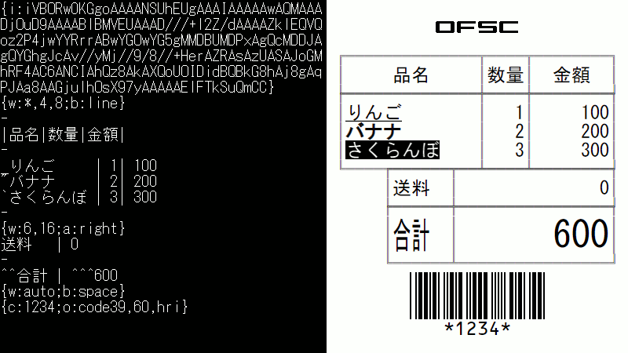
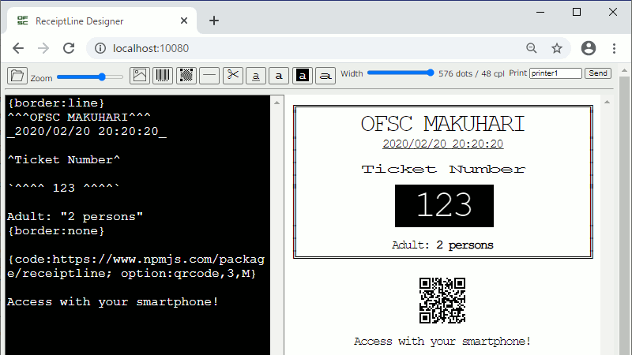

# receiptline

Printable digital receipts &#x1f9fe;  

Transform markdown-like text to receipt printer commands or SVG images.  

  
  

# Features

The reference implementation of the OFSC ReceiptLine Specification.  
http://www.ofsc.or.jp/receiptline/en/  

ReceiptLine is the receipt description language that expresses the output image of small roll paper.  
It supports printing paper receipts using a receipt printer and displaying electronic receipts on a POS system or smartphone.  
It can be described simply with markdown-like text data that does not depend on the paper width.  

This reference implementation also provides the development tool "ReceiptLine Designer" for editing, previewing, hex dumps with a virtual printer, and test printing on receipt printers with LAN support.  

# Receipt Printers

- Epson TM series
- SII RP series
- Star MC series
- Citizen CT series
- Fujitsu FP series

  

# Installation

```bash
$ npm install receiptline
```

# Usage

`receiptline.transform()` method transforms ReceiptLine document to printer commands or SVG images.  

```javascript
const receiptline = require('receiptline');

const doc = '{code:2012345678903;option:ean,hri}';

// printer example
const printer = {
    cpl: 42,
    encoding: 'cp437',
    upsideDown: false,
    gamma: 1.8,
    command: 'escpos'
};
const command = receiptline.transform(doc, printer);

// display example
const display = {
    cpl: 42,
    encoding: 'cp437'
};
const svg = receiptline.transform(doc, display);
```

## Method

`receiptline.transform(doc, printer)`  

### Parameters

- `doc`
  - a string of ReceiptLine document
- `printer`
  - an object of printer configuration

### Return value

- printer commands or SVG images

## Printer configuration

- `cpl`
  - characters per line (default: `48`)
- `encoding`
  - `cp437`: United States (default)
  - `cp852`: Central European
  - `cp858`: Western European
  - `cp860`: Portuguese
  - `cp863`: French Canadian
  - `cp865`: Nordic
  - `cp866`: Cyrillic
  - `cp932`: Japanese
  - `cp1252`: Western European
- `gamma` (for printer)
  - image gamma correction (default: `1.8`)
- `upsideDown` (for printer)
  - `false`: normal (default)
  - `true`: upside down
- `command`
  - `svg`: SVG (default)
  - `escpos`: Epson, Citizen
  - `sii`: SII
  - `starmbcs`: Star MBCS
  - `starsbcs`: Star SBCS
  - `fit`: Fujitsu

# Examples

### example/nodejs/\*

Enter markdown-like text from the web form, transform it to printer commands on the server, and print it out.  

### example/js/\*

Enter markdown-like text from the web form, transform it to SVG images on the web browser, and display it.  

### example/data/\*

The documents (markdown-like text) are the same as the examples in the OFSC ReceiptLine Specification.  

# Libraries

### lib/receiptline.js

JavaScript ES2015(ES6) version. It works on both web browser and Node.js.  
To output printer commands on a web browser, use Browserify.  

```bash
$ browserify -o receiptline-full.js receiptline.js
```

### lib/qrcode-generator/qrcode.js

Generate the QR Code for display. Optional.  

# ReceiptLine Designer

The ReceiptLine Designer provides more features.  

- Edit and preview
- Data transmission via TCP socket
- Hex dump view by listening TCP 19100 port

  

## Setup

1. Start the server

    ```bash
    $ cd node_modules/receiptline
    $ npm start
    ```

1. Open http://localhost:10080

    Use a modern browser.  

1. Configure printers.json

    ```json
    "printer_id": {
        "host": "127.0.0.1",
        "port": 19100,
        "cpl": 48,
        "encoding": "cp437",
        "gamma": 1.8,
        "upsideDown": false,
        "command": "svg"
    }
    ```

    - `printer_id`
      - printer identifier (alphanumeric or underscore characters)
    - `host`
      - printer address
    - `port`
      - printer port (will be `9100`)
    - `cpl`, `encoding`, `gamma`, `upsideDown`, `command`
      - see the printer configuration above

# Syntax

## Railroad diagram

**_document_**  
  

**_line_**  
  

**_columns_**  
  

**_column_**  
  

**_text_**  
  

**_char_**  
  

**_escape_**  
  

**_ws (whitespace)_**  
  

**_property_**  
  

**_member_**  
  

**_key_**  
  

**_value_**  
  

# Grammar

## Structure

The receipt is made of a table, which separates each column with a pipe `|`.  

|Line|Content|Description|
|---|---|---|
|_column_<br><code>&#x7c;</code> _column_ <code>&#x7c;</code><br><code>&#x7c;</code> _column_<br>_column_ <code>&#x7c;</code>|Text<br>Property|Single column|
|_column_ <code>&#x7c;</code> _column_ <br><code>&#x7c;</code> _column_ <code>&#x7c;</code> _column_ <code>&#x7c;</code><br><code>&#x7c;</code> _column_ <code>&#x7c;</code> _column_<br>_column_ <code>&#x7c;</code> _column_ <code>&#x7c;</code>|Text|Double column|
|_column_ <code>&#x7c;</code> _..._ <code>&#x7c;</code> _column_<br><code>&#x7c;</code> _column_ <code>&#x7c;</code> _..._ <code>&#x7c;</code> _column_ <code>&#x7c;</code><br><code>&#x7c;</code> _column_ <code>&#x7c;</code> _..._ <code>&#x7c;</code> _column_<br>_column_ <code>&#x7c;</code> _..._ <code>&#x7c;</code> _column_ <code>&#x7c;</code>|Text|Multiple columns|

## Alignment

The column is attracted to the pipe `|` like a magnet.  
<code>&#x2423;</code> means one or more whitespaces.  

|Column|Description|
|---|---|
|_column_<br><code>&#x7c;</code>_column_<code>&#x7c;</code><br><code>&#x7c;&#x2423;</code>_column_<code>&#x2423;&#x7c;</code>|Center|
|<code>&#x7c;</code>_column_<br><code>&#x7c;</code>_column_<code>&#x2423;&#x7c;</code><br>_column_<code>&#x2423;&#x7c;</code>|Left|
|_column_<code>&#x7c;</code><br><code>&#x7c;&#x2423;</code>_column_<code>&#x7c;</code><br><code>&#x7c;&#x2423;</code>_column_|Right|

## Text

The text is valid for any column.  

```
Asparagus | 0.99
Broccoli | 1.99
Carrot | 2.99
---
^TOTAL | ^5.97
```

Characters are printed in a monospace font (12 x 24 px).  
Wide characters are twice as wide as Latin characters (24 x 24 px).  
Control characters are ignored.  

## Special characters in text

Special characters are assigned to characters that are rarely used in the receipt.  

|Special character|Description|
|---|---|
|`\`|Character escape|
|<code>&#x7c;</code>|Column delimiter|
|`{`|Property delimiter (Start)|
|`}`|Property delimiter (End)|
|`-` (1 or more, exclusive)|Horizontal rule|
|`=` (1 or more, exclusive)|Paper cut|
|`~`|Space|
|`_`|Underline|
|`"`|Emphasis|
|`` ` ``|Invert|
|`^`|Double width|
|`^^`|Double height|
|`^^^`|2x size|
|`^^^^`|3x size|
|`^^^^^`|4x size|
|`^^^^^^`|5x size|
|`^^^^^^^` (7 or more)|6x size|

## Escape sequences in text

Escape special characters.  

|Escape sequence|Description|
|---|---|
|`\\`|&#x5c;|
|<code>&#x5c;&#x7c;</code>|&#x7c;|
|`\{`|&#x7b;|
|`\}`|&#x7d;|
|`\-`|&#x2d; (Cancel horizontal rule)|
|`\=`|&#x3d; (Cancel paper cut)|
|`\~`|&#x7e;|
|`\_`|&#x5f;|
|`\"`|&#x5f;|
|``\` ``|&#x60;|
|`\^`|&#x5e;|
|`\n`|Wrap text manually|
|`\x`_nn_|Hexadecimal character code|
|`\`_char_ (Others)|Ignore|

## Properties

The property is valid for lines with a single column.  

```
{ width: * 10; comment: the column width is specified in characters }
```

|Key|Abbreviation|Value|Case-sensitive|Default|Saved|Description|
|---|---|---|---|---|---|---|
|`image`|`i`|_base64 png format_|✓|-|-|Image<br>(Recommended: monochrome, critical chunks only)|
|`code`|`c`|_textdata_|✓|-|-|Barcode / 2D code|
|`option`|`o`|_see below_|-|`code128 2 72 nohri 3 l`|✓|Barcode / 2D code options<br>(Options are separated by commas or one or more whitespaces)|
|`align`|`a`|`left`<br>`center`<br>`right`|-|`center`|✓|Line alignment<br>(Valid when line width &lt; CPL)|
|`width`|`w`|`auto`<br>`*`<br>`0` -|-|`auto`<br>(`*` for all columns)|✓|Column widths (chars)<br>(Widths are separated by commas or one or more whitespaces)|
|`border`|`b`|`line`<br>`space`<br>`none`<br>`0` - `2`|-|`space`|✓|Column border (chars)<br>(Border width: line=1, space=1, none=0)|
|`text`|`t`|`wrap`<br>`nowrap`|-|`wrap`|✓|Text wrapping|
|`command`|`x`|_textdata_|✓|-|-|Device-specific commands|
|`comment`|`_`|_textdata_|✓|-|-|Comment|

## Barcode options

Barcode options are separated by commas or one or more whitespaces.  

|Barcode option|Description|
|---|---|
|`upc`|UPC-A, UPC-E<br>(Check digit can be omitted)|
|`ean`<br>`jan`|EAN-13, EAN-8<br>(Check digit can be omitted)|
|`code39`|CODE39|
|`itf`|Interleaved 2 of 5|
|`codabar`<br>`nw7`|Codabar (NW-7)|
|`code93`|CODE93|
|`code128`|CODE128|
|`2` - `4`|Barcode module width (px)|
|`24` - `240`|Barcode module height (px)|
|`hri`|With human readable interpretation|
|`nohri`|Without human readable interpretation|

## 2D code options

2D code options are separated by commas or one or more whitespaces.  

|2D code option|Description|
|---|---|
|`qrcode`|QR Code|
|`3` - `8`|Cell size (px)|
|`l`<br>`m`<br>`q`<br>`h`|Error correction level|

## Special characters in property values

Special characters in property values are different from special characters in text.  

|Special character|Description|
|---|---|
|`\`|Character escape|
|<code>&#x7c;</code>|Column delimiter|
|`{`|Property delimiter (Start)|
|`}`|Property delimiter (End)|
|`:`|Key-value separator|
|`;`|Key-value delimiter|

## Escape sequences in property values

Escape special characters.  

|Escape sequence|Description|
|---|---|
|`\\`|&#x5c;|
|<code>&#x5c;&#x7c;</code>|&#x7c;|
|`\{`|&#x7b;|
|`\}`|&#x7d;|
|`\;`|&#x3b;|
|`\n`|New line|
|`\x`_nn_|Hexadecimal character code|
|`\`_char_ (Others)|Ignore|

# Restrictions

- Communication with the printer, status event processing, and error handling are out of scope.
- SVG images depend on the font family installed on the computer and may not display properly.
- The QR code for display is encoded in UTF-8, while the QR code for printing is encoded in ASCII or Shift_JIS.

# Author

Open Foodservice System Consortium  
http://www.ofsc.or.jp/  

# License

- receiptline
  - Apache License, Version 2.0
- QR Code Generator for JavaScript with UTF8 Support
  - MIT License
